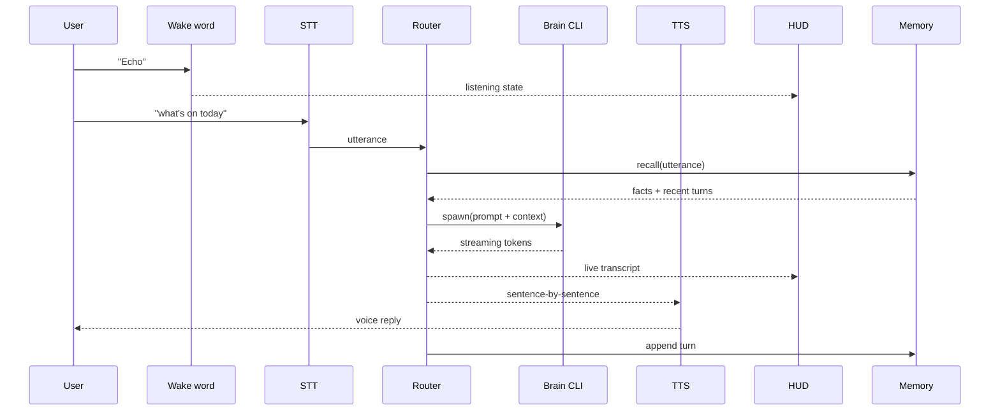
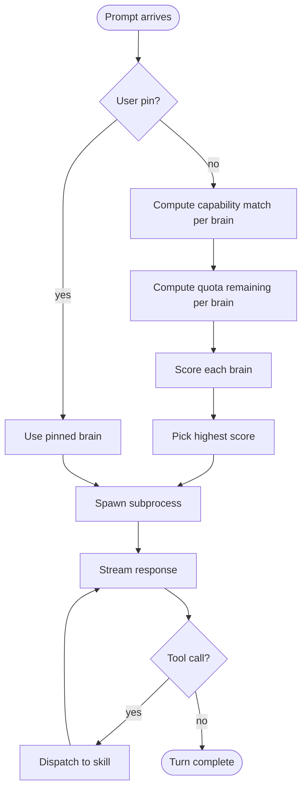
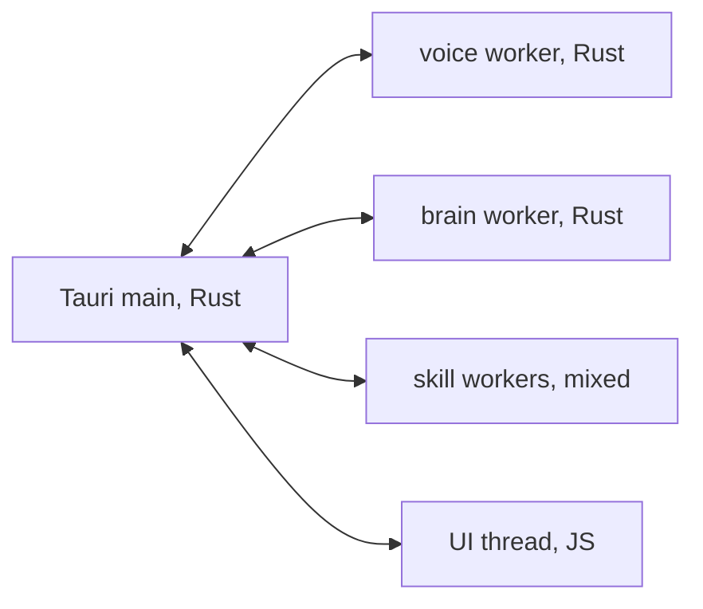

# Echo, Architecture

Reference document for the system shape. Updated when the design moves.

## High-level diagram

```mermaid
flowchart TB
  subgraph User
    Mic[Mic]
    Spkr[Speakers]
    Disp1[Primary monitor]
    Disp2[Secondary monitor]
    Disp3[Ambient monitor]
  end

  subgraph Echo["Echo (Tauri 2 shell, Rust core)"]
    direction TB
    VoiceLoop[Voice loop, cpal + whisper.cpp + Porcupine]
    HUD[HUD windows, React + Tailwind]
    Router[Brain router]
    SkillsBus[Skills bus, MCP stdio]
    Memory[Memory store, Markdown + JSONL + sqlite-vss]
    Proactive[Proactive scheduler]
    Keychain[OS keychain]
  end

  subgraph Brains["Brain CLIs, subscription-backed"]
    Claude[claude, Claude Code]
    Codex[codex, Codex CLI]
    Gemini[gemini, Gemini CLI]
  end

  subgraph Skills["Skills, OAuth + local"]
    Cal[Calendar, Google + Microsoft + Apple]
    Mail[Mail, Google + Microsoft + Apple]
    Files[Local files]
    Web[Web search]
    Vision[Screen capture]
    Music[Music control]
    Home[Home Assistant]
    Health[Apple Health + Google Fit]
    Notes[Notion + Obsidian]
    Tasks[Linear + GitHub]
    Slack[Slack]
    News[News + weather + finance]
  end

  Mic --> VoiceLoop
  VoiceLoop --> Router
  Router --> Claude
  Router --> Codex
  Router --> Gemini
  Claude --> Router
  Codex --> Router
  Gemini --> Router
  Router --> SkillsBus
  SkillsBus --> Cal
  SkillsBus --> Mail
  SkillsBus --> Files
  SkillsBus --> Web
  SkillsBus --> Vision
  SkillsBus --> Music
  SkillsBus --> Home
  SkillsBus --> Health
  SkillsBus --> Notes
  SkillsBus --> Tasks
  SkillsBus --> Slack
  SkillsBus --> News
  Router --> Memory
  Memory --> Router
  Router --> HUD
  HUD --> Disp1
  HUD --> Disp2
  HUD --> Disp3
  Proactive --> SkillsBus
  Proactive --> HUD
  Proactive --> VoiceLoop
  VoiceLoop -. TTS .-> Spkr
  Keychain -. tokens .-> SkillsBus
```



## Voice-turn sequence



## Request lifecycle

For a single turn:

1. Wake word fires, HUD shifts to "listening", microphone arms VAD.
2. Speech captured until end-of-utterance silence.
3. Whisper transcribes, streaming partials shown in HUD.
4. Router queries each enabled brain's quota, picks a winner.
5. Router builds the context envelope: recent N turns, signal-ranked memories, active skill manifest, HUD-observable state, profile.
6. Subprocess spawned for the chosen brain CLI. Prompt sent to stdin, response streamed from stdout.
7. As tokens arrive, the router parses for tool calls (MCP shape). Tool calls are dispatched to the skill bus. Skill responses are fed back to the brain.
8. Final text is split into sentences and streamed to the TTS backend. HUD shows live captions.
9. The full turn (user utterance, brain choice, tool calls, final text) is journaled to today's JSONL in memory.
10. After the turn, the memory indexer updates the embeddings index. If durable facts are detected (the user said "remember that..."), they are appended to `facts/`.

## Brain router decision flow



## Skill API

Every skill exposes the MCP-style contract:

```
list_tools  -> ToolDef[]
call_tool   -> { tool, args }  =>  { ok: true, result } | { ok: false, error }
```

Skills run as subprocesses Echo spawns lazily, kept warm with idle timeouts. Stdio JSON-RPC. Tokens for OAuth-based skills are loaded from the OS keychain by the skill itself, not Echo.

## Memory store layout

```
~/.echo/
  brains.yml                  # which CLIs are enabled and configured
  displays.yml                # multi-monitor role assignment
  profile.yml                 # user profile
  proactive.yml               # watch list and crons
  memory/
    facts/                    # one Markdown fact per file
      *.md
    episodes/                 # daily JSONL of conversations
      YYYY/MM/DD.jsonl
    digests/                  # one structured digest per session
      session_*.md
    index.md                  # autogenerated index of facts
    embeddings.sqlite         # sqlite-vss vector index
  models/
    whisper-*.bin
    piper-voices/
  skills/                     # installed skill packages
    <skill-name>/
      skill.yml
      bin/<runtime entry>
  logs/
    echo.log                  # rolling app log
    audit.log                 # outbound network calls per skill
  cache/
```

## OS-specific concerns

| Concern | macOS | Windows | Linux |
|---|---|---|---|
| Native menubar app | NSStatusItem via Tauri | Notification area | AppIndicator |
| Screen capture | ScreenCaptureKit / `screencapture` | `Graphics.Capture` | XDG portal |
| Microphone | AVFoundation via cpal | WASAPI via cpal | ALSA / PipeWire via cpal |
| TTS | AVSpeechSynthesizer | SAPI5 | espeak-ng / Piper |
| Wake word | Porcupine SDK | Porcupine SDK | Porcupine SDK |
| Keychain | Keychain Services | DPAPI / Credential Vault | Secret Service (libsecret) |
| Cron | launchd helper | Task Scheduler | systemd user units |
| Auto-update | Tauri updater (DMG) | Tauri updater (MSI) | Tauri updater (AppImage) |
| Multi-display | NSScreen | EnumDisplayMonitors | randr / Wayland |

## Concurrency model



Workers are independent Rust tasks. The main process is the supervisor and the IPC bus. The UI thread (the HUD windows) talks to the main process via Tauri commands and events.

A failed worker is restarted with exponential backoff. The HUD shows a yellow dot next to any non-green subsystem so the user always knows.

## Phase one deliverable shape

For Phase 1 the architecture collapses to:

- Tauri shell with one HUD window on the primary display
- One voice worker (wake word, STT, TTS)
- One brain worker (Claude CLI only)
- Three skill workers (weather, web search, files)
- Memory store with PreSession digest only (no embeddings index yet, plain recency recall)
- No proactive scheduler yet (manual prompts only)

The architecture above is the steady-state design. Phases gradually fill it in.
